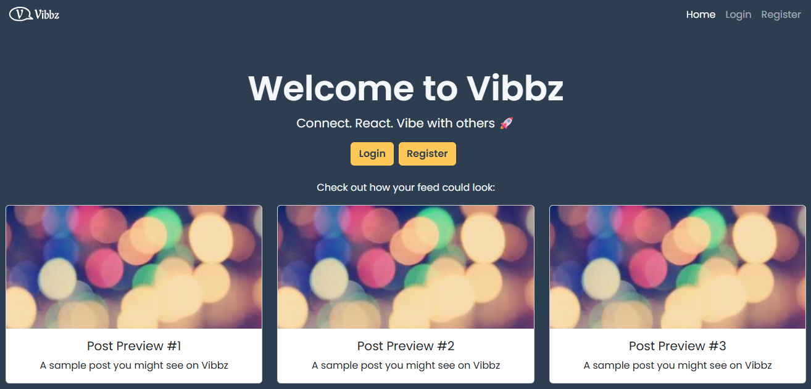

# Vibbz 🎉

# Description

**Vibbz** is a modern, accessible, and responsive social media application developed as part of the **Noroff Front-End Development Exam (Fall 2025)**.  
The goal was to design and build a new, user-friendly front end for an existing Social Media API, with focus on **UI/UX**, **accessibility (WCAG)**, and **performance**.

Users can register, log in, view posts, react with emojis, comment, and manage their own profiles.  
The design was created in **Figma** and tested by multiple users to gather insights for improving usability and visual consistency.

---

## 🚀 Quick Start

```bash
# Clone the repository
git clone https://github.com/piasun/project-exam-2-vibbz.git

# Navigate into the project folder
cd project-exam-2-vibbz

# Install dependencies
npm install

# Run the development server
npm run dev

```

---

🔧 Environment Variables

Before running the project, create a .env file in the root directory based on .env.example.

The file should include:

```bash
VITE_API_BASE=https://nf-api.onrender.com/api/v1/social
VITE_NOROFF_API_KEY=your_api_key_here
```

⚠️ Do not commit your .env file. It should be excluded via .gitignore.

---

# 🛠️ Technologies Used

- [React](https://reactjs.org/)
- [Vite](https://vitejs.dev/)
- [Bootstrap 5](https://getbootstrap.com/)
- [React Router](https://reactrouter.com/)
- [Axios](https://axios-http.com/)
- [Figma](https://www.figma.com/) (UI/UX design)
- [GitHub Projects](https://github.com/features/project-management)

---

# 🚀 Features

- ✅ User authentication (register/login restricted to @stud.noroff.no emails)
- ✅ Protected routes and dynamic UI based on login state
- ✅ View, create, and react to posts (emojis and comments)
- ✅ Profile management (view, edit, and follow/unfollow users)
- ✅ Responsive and accessible UI (WCAG compliant)
- ✅ Error handling and API integration using Axios

---

🧱 Folder Structure

```bash
src/
├── assets/
├── components/
├── context/
├── hooks/
├── pages/
├── styles/
└── utils/
```

---

⚙️ Scripts

| Command           | Description                   |
| ----------------- | ----------------------------- |
| `npm run dev`     | Starts the development server |
| `npm run build`   | Builds the app for production |
| `npm run preview` | Previews the production build |

All scripts are tested on a fresh clone to ensure smooth setup.

---

🧹 .gitignore Checklist

Ensure the following are excluded:

```bash
node_modules/
dist/
build/
.env*
.DS_Store
```

---

🌐 Live Demo
[](https://vibbz.netlify.app/)
👉[Vibbz on Netlify](https://vibbz.netlify.app/)

---

📬 Contact

Developer: Pia Sun
📧 [GitHub Profile](https://github.com/piasun)

---

🙏 Acknowledgments

- Noroff Front-End Development Program
- Noroff Social API
- Instructor & peer feedback
- User testing participants who provided design insights
